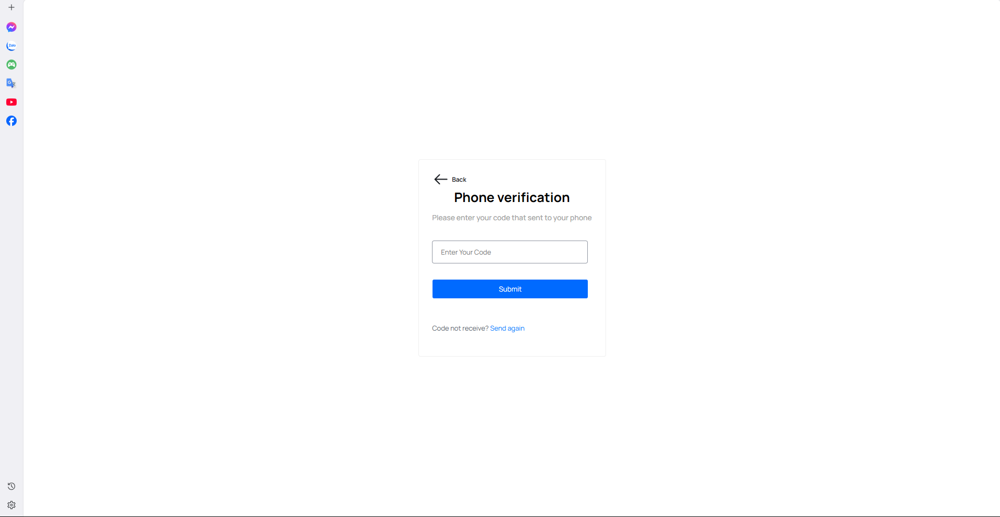
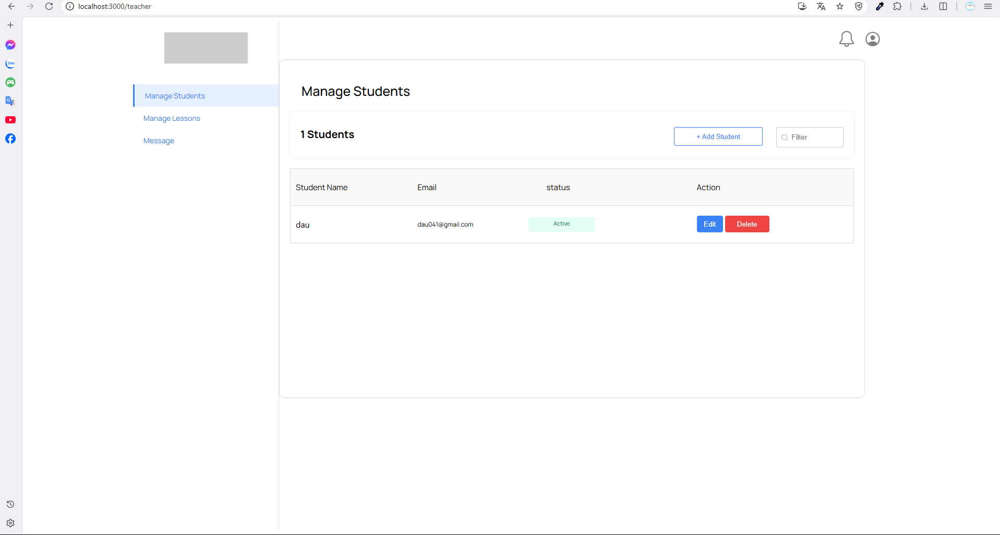
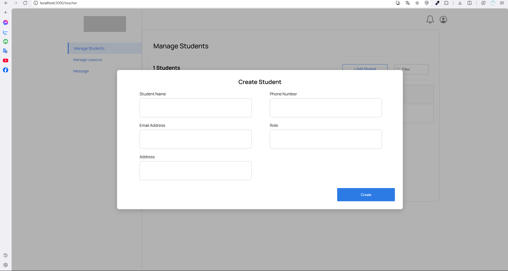
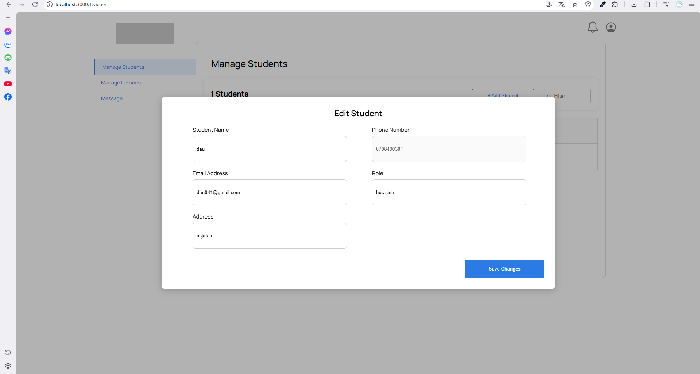
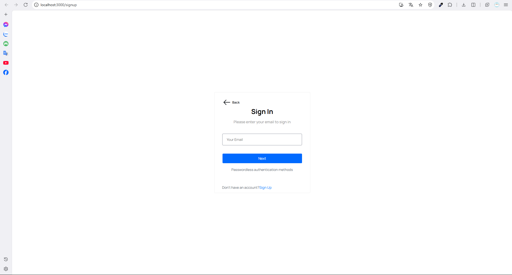
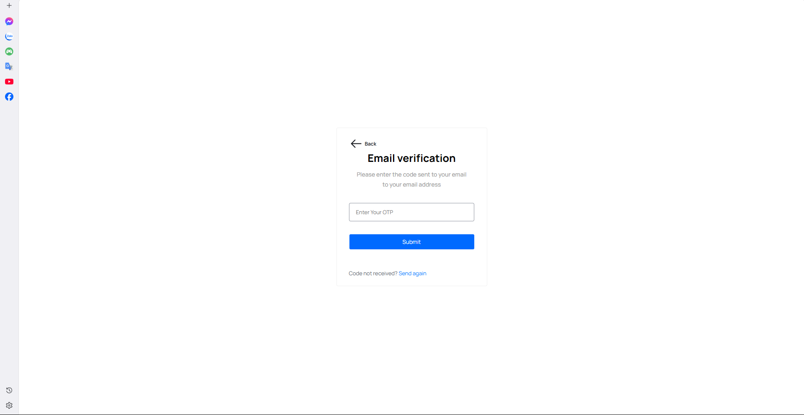

 # Project Structure

## Backend (back_end)
- index.js: Start Express server, configure routes  
- firebase.js, serviceAccountKey.json: Connect to Firebase  
- .env: Environment variables  
- routes/student.js: Student management (CRUD)  
- routes/emailOTP.js: Email OTP verification, send mail, reset password  
- routes/otp.js: Other OTP verification  
- package.json, package-lock.json: Dependency management  

## Frontend (front_end)
- public/: Static files (index.html, favicon, ...)  
- src/App.js, src/index.js: Initialize React app  
- src/services/api.js: Communicate with backend via axios  
- src/component/: Shared components (setupaccount.js, studentform.js, ...)  
- src/Page/login_form/: Login page  
- src/Page/manage_teacher/: Teacher management  
- src/Page/verivyOTP/verifyotp.jsx: Email OTP verification  
- src/Router/index.jsx: React routing management  
- src/App.css, src/index.css: Style files  
- package.json, package-lock.json: Frontend dependencies  

## Root
- README.md: Project information  
- package.json, package-lock.json: Common dependencies
````markdown

## 🚀 How to Run the Project

To run this project, follow these steps:

---


### 1️⃣ Backend

**1.1. Go to the backend folder:**
```bash
cd back_end
```

**1.2. Install dependencies:**
```bash
npm install
```

**1.3. Configure environment variables**
Create a `.env` file if it doesn't exist and add the required variables, for example:
```env
EMAIL_USER=your_email@example.com
EMAIL_PASS=your_email_password
# Add other variables if needed
```

**1.4. Start the backend server:**
```bash
npm run dev
```

> ⚡ Backend runs at: `http://localhost:5000`

---


### 2️⃣ Frontend

**2.1. Go to the frontend folder:**
```bash
cd front_end
```

**2.2. Install dependencies:**
```bash
npm install
```

**2.3. Start the React app:**
```bash
npm start
```

> ⚡ Frontend runs at: `http://localhost:3000`

---


### 3️⃣ Access the Application

* 🌐 **Frontend:** [http://localhost:3000](http://localhost:3000)
* 🔗 **Backend API:** [http://localhost:5000](http://localhost:5000)

---


### 4️⃣ Receive OTP via Email and SMS

> Receive SMS OTP: Check the `accessCodes` collection in Firebase Firestore to view the OTP code.

> Receive Email OTP: The OTP will be sent directly to the student's registered email via Nodemailer.

---


### 💡 Notes

* Make sure the backend is running before starting the frontend so that the APIs work properly.
* Check that `.env` contains the correct email and other environment variables for OTP/email features to work.
* You can change the port if needed by editing `index.js` or `.env`.


<div align="center"><i>Login with phone number page</i></div>


<div align="center"><i>OTP verification via SMS page</i></div>


<div align="center"><i>Student management page (teacher account)</i></div>


<div align="center"><i>Add student to list page</i></div>


<div align="center"><i>Edit student information page</i></div>


<div align="center"><i>Login with student email page</i></div>


<div align="center"><i>OTP verification sent via email page</i></div>

