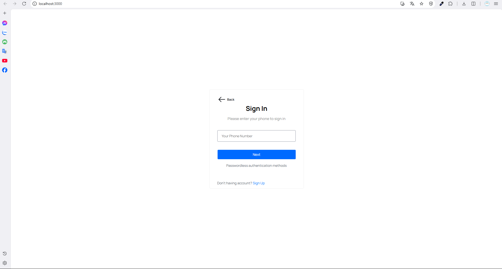

## 🚀 Project Structure

### Backend (back_end)
- `index.js`: Starts the Express server and configures routes  
- `firebase.js`, `serviceAccountKey.json`: Connects to Firebase  
- `.env`: Environment variables  
- `routes/student.js`: Student management (CRUD)  
- `routes/emailOTP.js`: Email OTP verification, sending emails, password reset  
- `routes/otp.js`: Other OTP verification  
- `package.json`, `package-lock.json`: Library management  

### Frontend (front_end)
- `public/`: Static files (index.html, favicon, etc.)  
- `src/App.js`, `src/index.js`: Initializes the React application  
- `src/services/api.js`: Communicates with backend via Axios  
- `src/component/`: Shared components (`setupaccount.js`, `studentform.js`, etc.)  
- `src/Page/login_form/`: Login pages  
- `src/Page/manage_teacher/`: Teacher management  
- `src/Page/verivyOTP/verifyotp.jsx`: Email OTP verification  
- `src/Router/index.jsx`: React routing management  
- `src/App.css`, `src/index.css`: Styling files  
- `package.json`, `package-lock.json`: Frontend dependencies  

### Root
- `README.md`: Project information  
- `package.json`, `package-lock.json`: Root-level dependencies

---
## 🚀 Project Run Guide

Follow the steps below to run this project:

---

### 1️⃣ Backend

**1.1. Navigate to the backend folder:**
```bash
cd back_end
````

**1.2. Install required packages:**

```bash
npm install
```

**1.3. Configure environment variables**
Create a `.env` file if it doesn’t exist and fill in the necessary environment variables, for example:

```env
EMAIL_USER=your_email@example.com
EMAIL_PASS=your_email_password
# Add other variables if needed
```

**1.4. Run the backend server:**

```bash
npm run dev
```

> ⚡ Backend runs by default at: `http://localhost:5000`

---

### 2️⃣ Frontend

**2.1. Navigate to the frontend folder:**

```bash
cd front_end
```

**2.2. Install required packages:**

```bash
npm install
```

**2.3. Run the React application:**

```bash
npm start
```

> ⚡ Frontend runs by default at: `http://localhost:3000`

---

### 3️⃣ Access the Application

* 🌐 **Frontend:** [http://localhost:3000](http://localhost:3000)
* 🔗 **Backend API:** [http://localhost:5000](http://localhost:5000)

---

### 4️⃣ Receiving OTP via Email and SMS

> **SMS OTP:** Check in Firestore under `accessCodes` to see the OTP.

> **Email OTP:** Sent directly to the student’s registered email using Nodemailer.

---

### 💡 Notes

* Make sure the backend is running before opening the frontend for API requests to work properly.
* Verify that `.env` contains the correct email credentials and other necessary environment variables for OTP/email functionality.
* You can change the ports if needed by modifying `index.js` or `.env`.
---



<div align="center"><i>Login page using phone number</i></div>


<div align="center"><i>OTP verification page via SMS</i></div>


<div align="center"><i>Student management page for teacher accounts</i></div>


<div align="center"><i>Add student to the list page</i></div>


<div align="center"><i>Edit student profile page</i></div>


<div align="center"><i>Login page using student email</i></div>


<div align="center"><i>OTP verification page sent via email</i></div>


